<div align="center">

# OmniKube

**统一管控每一个 Kubernetes 集群**

企业级多集群 · 多租户 Kubernetes 管理平台 —— 细粒度权限、可视化运维、实时观测、全量审计,一个控制台搞定。

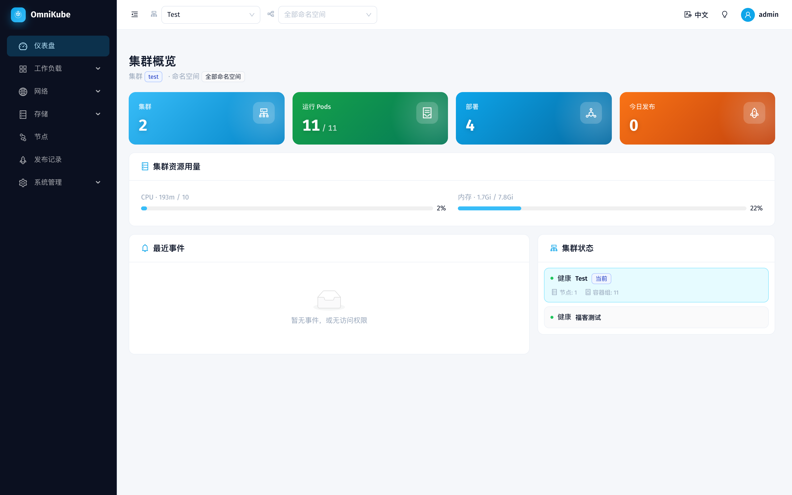

</div>

---

## ✨ 功能一览

### 多集群管理
- 多集群统一纳管:添加 / 编辑 / 删除、连接测试,kubeconfig **AES-256-GCM 加密**存储。
- 顶栏一键切换集群 / 命名空间,权限内的集群才可见。

### 工作负载与运维
- Deployment / StatefulSet / DaemonSet / Pod / Job / CronJob 列表、详情、可视化创建、YAML 编辑。
- **日常运维动作**:伸缩副本、滚动重启、**版本历史(含变更人)+ 一键回滚上一版本**、资源事件查看。
- 列表 / 详情**自动刷新**(自适应轮询),伸缩/发布后就绪数自己更新。
- **WebSSH 终端** + Pod 实时日志(WebSocket)。

### 网络 / 存储 / 节点
- Service、Ingress(带正则重写路径编辑)、ConfigMap、Secret(明文揭示带审计)、PVC、PV、Node。
- 节点 CPU / 内存**水位**、Pod 用量列、仪表盘集群资源卡(接 **metrics-server**,缺失优雅降级)。

### 系统管理:用户 / 角色 / 集群权限(RBAC v3)

**用户管理**
- 创建用户(分配一个或多个角色)、启用 / 禁用、删除。
- **首登强制改密**;管理员**重置用户密码**并生成一次性临时密码(仅管理员可见入口)。

**角色管理**
- 角色 = 可复用的权限模板;支持**新建 / 编辑 / 复制**,`roles:create` 门控。
- 预置系统角色开箱即用:**集群管理员 / 集群只读 / 开发者 / 运维工程师 / 发布管理员 / 审计员**(初始化幂等播种,不可删可编辑,角色名按语言国际化)。
- 一个用户可绑定多个角色,权限取并集。

**集群权限(细粒度授权)**
- 每个角色包含两部分:
  - **全局权限**(平台级):`clusters / users / roles / releases / audit` × `view/create/edit/delete`(releases、audit 仅 view)。
  - **集群规则**(数据面):每条规则 = **某集群(或 `*` 全部)+ 范围(整集群 / 指定命名空间)+ 「每资源 × 操作」矩阵**,操作含 `view / create / edit / delete / exec(仅 Pod)/ reveal(仅 Secret)`。
- 前端用**权限矩阵**直观勾选(而非深层树);角色规则可跨多集群配置、复用首条配置。
- 底层经 `rbac.SyncUserGrants` 把角色**物化**成 Casbin `g/p` 策略,鉴权走 domain 域隔离;删除集群时级联清理规则并重物化受影响用户。
- **菜单按权限派生**:侧边栏子菜单由用户角色里「有 view 的资源」自动生成,看不到=无权限;写操作按钮按 `capabilities` 逐项显隐。

**登录安全**:图形验证码(纯标准库生成 + 波浪扭曲防 OCR)· JWT · bcrypt · 敏感操作全量审计。

### 审计与发布
- **审计中心**:中间件统一给所有写操作(含登录、伸缩、回滚、权限变更)埋点,**显示操作者用户名**,多维下拉筛选 + 分页 + **CSV 导出**。
- **发布记录**:工作负载改镜像自动记录发布人 / 前后镜像 / 更改原因。
- **发布通知机器人**:每集群可配 **钉钉 / 飞书 / 企业微信** webhook(支持**加签密钥**),发布时自动推送格式化消息。

### 体验
- **国际化**:中 / 英 / 日 / 韩 / 法 / 德 / 西 共 **7 种语言**。
- **明 / 暗主题**切换;登录页、密码页统一精致视觉。

---

## 🧱 技术栈

| 层 | 技术 |
|----|------|
| 后端 | Go · Gin · GORM · Casbin · client-go(dynamic client)· PostgreSQL |
| 前端 | React 18 · TypeScript · Vite · Ant Design 5 · Zustand · react-i18next |
| 观测 | metrics-server(节点 / Pod 用量) |
| 实时 | WebSocket(exec 终端 / 日志流) |

---

## 🚀 快速开始

### 前置
- Go 1.22+、Node 18+、一个可访问的 Kubernetes 集群(kubeconfig)
- PostgreSQL(下方用 Docker 起一个)

### 1. 数据库
```bash
docker run -d --name omnikube-pg -p 5433:5432 \
  -e POSTGRES_USER=omnikube -e POSTGRES_PASSWORD=omnikube -e POSTGRES_DB=omnikube \
  postgres:16
```

### 2. 后端
```bash
cd backend
cp config.yaml.example config.yaml   # 填 jwt_secret(≥32 字符)、master_key(base64 32 字节)
#   openssl rand -hex 32   /   openssl rand -base64 32
go run ./cmd/server -config config.yaml   # 监听 :8080,首启自动建表 + 播种 admin 与预置角色
```

### 3. 前端
```bash
cd frontend
npm install
npm run dev            # :5173,已配代理 /api + ws → :8080
```

打开 http://localhost:5173,用 config 里的 admin 账号登录(首登会要求改密)。

---

## 📁 目录结构

```
backend/    Go 后端(cmd/server 入口;internal: handler / rbac / cluster / notify / captcha / audit / middleware / ws ...)
frontend/   React 前端(src: pages / components / api / store / i18n)
docs/       设计文档(docs/superpowers/specs)、功能查漏 feature-gaps.md
images/     界面截图
video/      产品演示视频(成片 + 可复现源码)
PRD/        产品需求文档
```

---

## 🧪 测试

```bash
# 后端
cd backend && go test ./...

# 前端
cd frontend && npm run lint && npm test && npm run build
```

---

## 📸 界面截图

### 工作负载

| 部署列表 | 部署详情 | 容器组 |
|---|---|---|
| 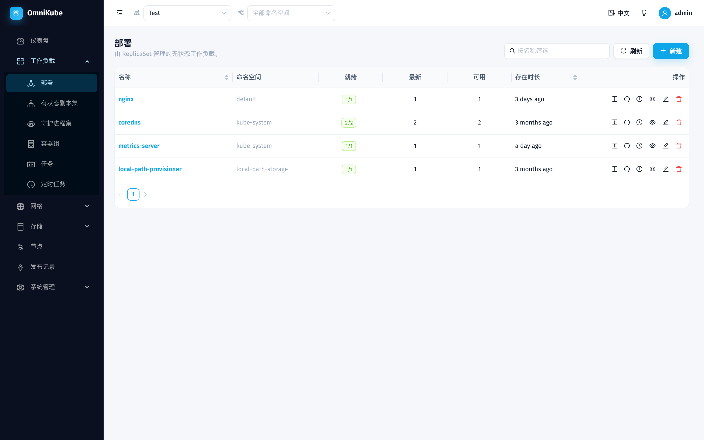 | 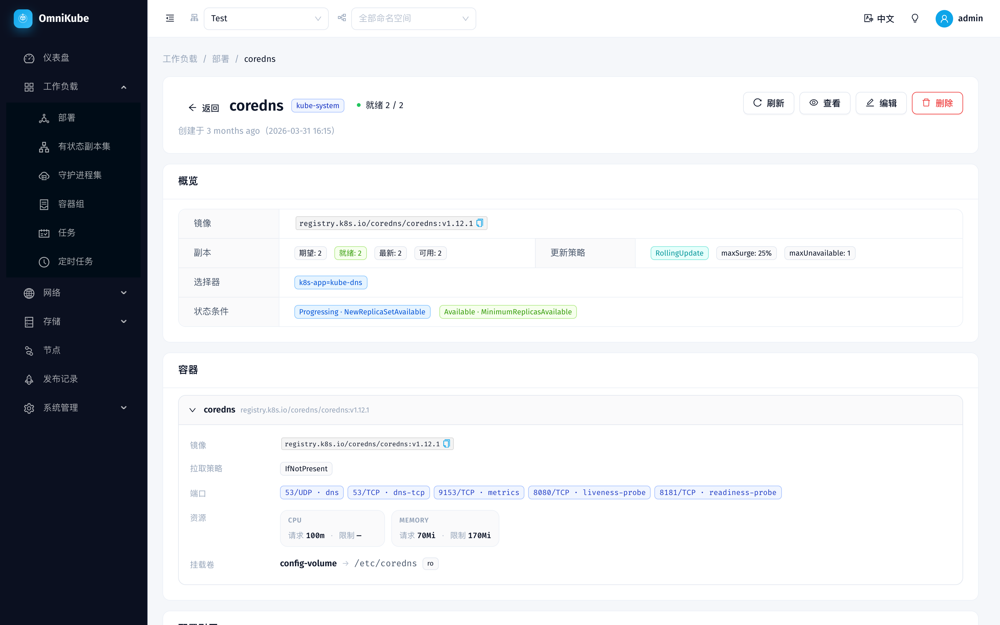 | 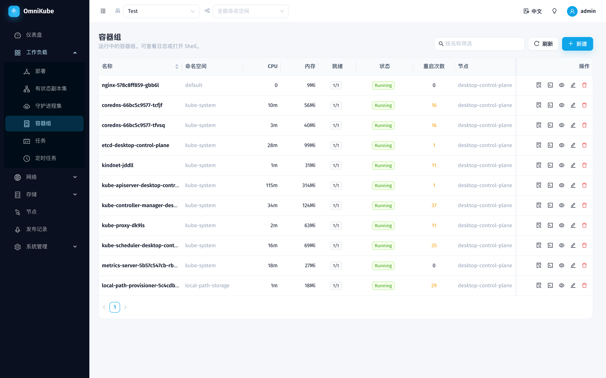 |

| 有状态副本集 | 守护进程集 | 定时任务 |
|---|---|---|
| 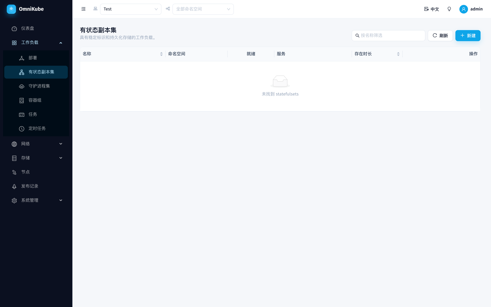 | 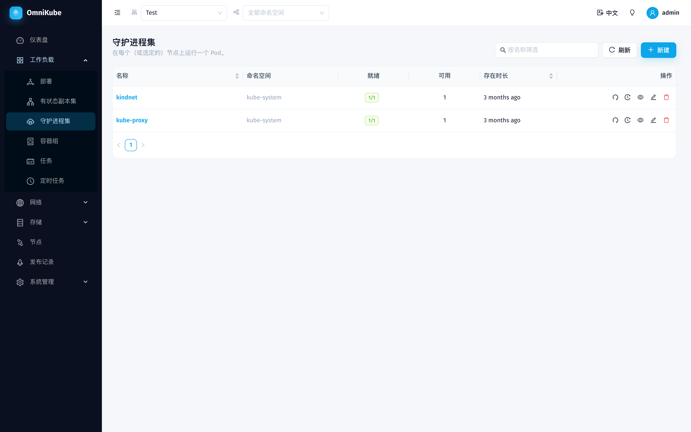 | 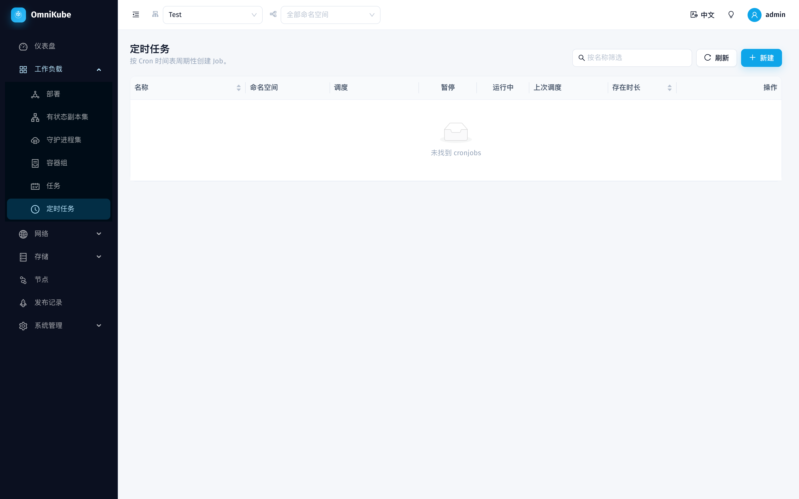 |

### 网络 · 存储 · 节点

| 服务 | ConfigMap | 节点 |
|---|---|---|
| 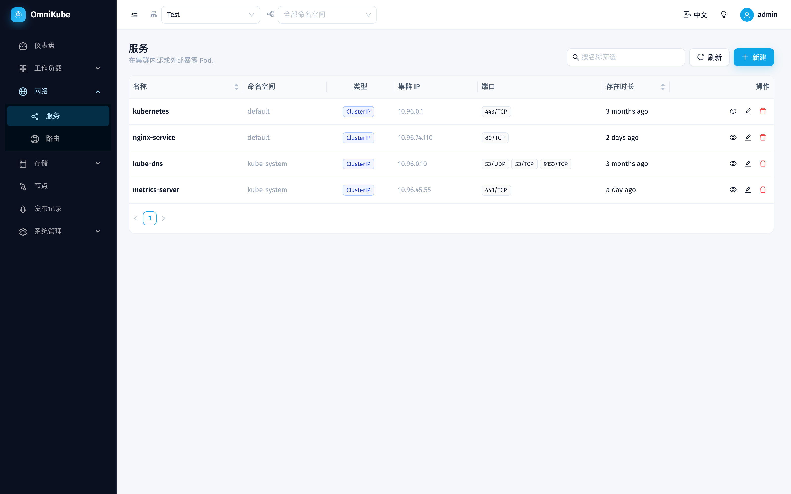 | 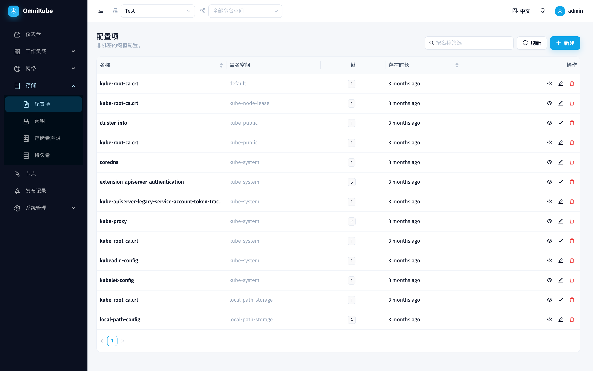 | 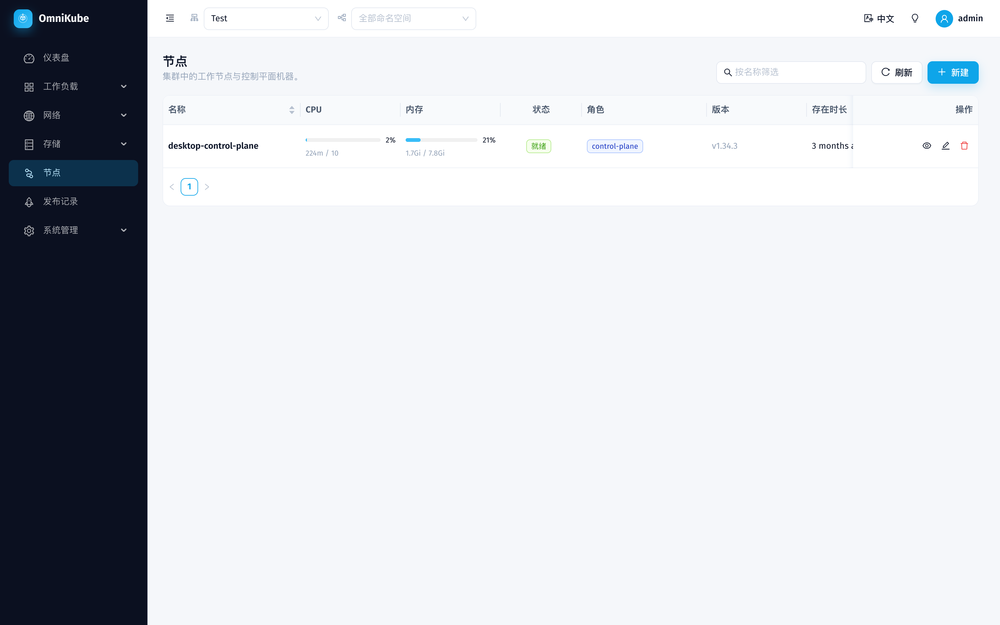 |

### 系统管理

| 用户 | 角色 | 审计日志 |
|---|---|---|
| 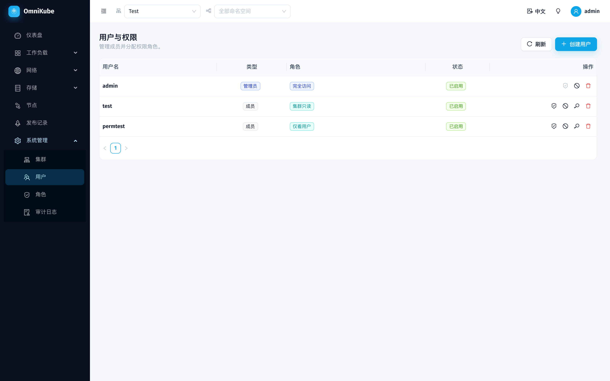 | 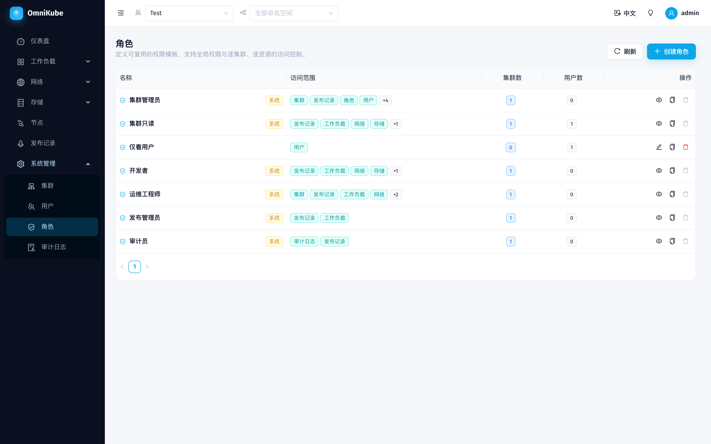 | 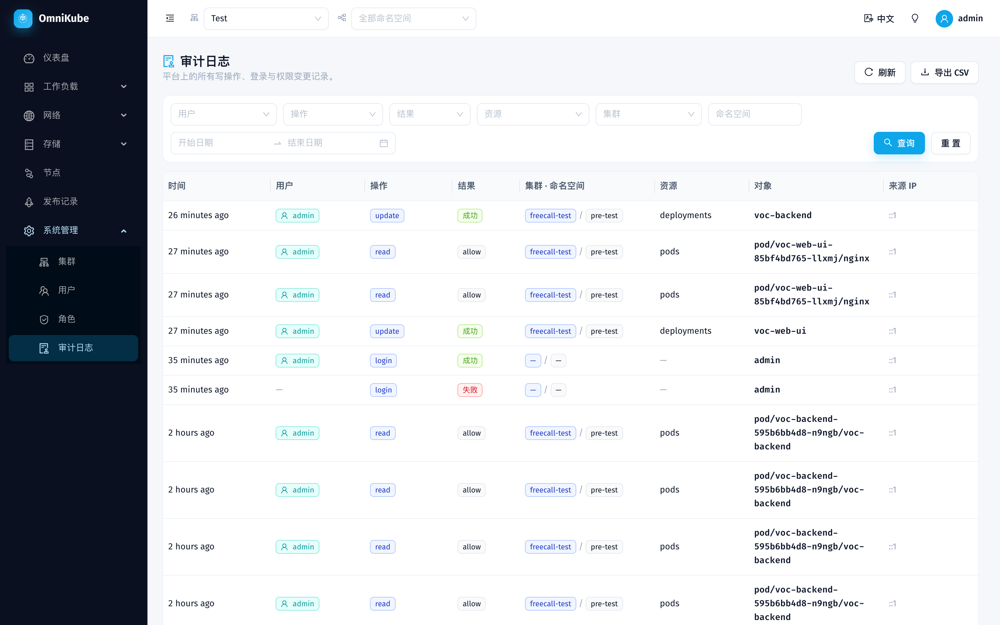 |

| 集群管理 | 发布记录 |
|---|---|
| 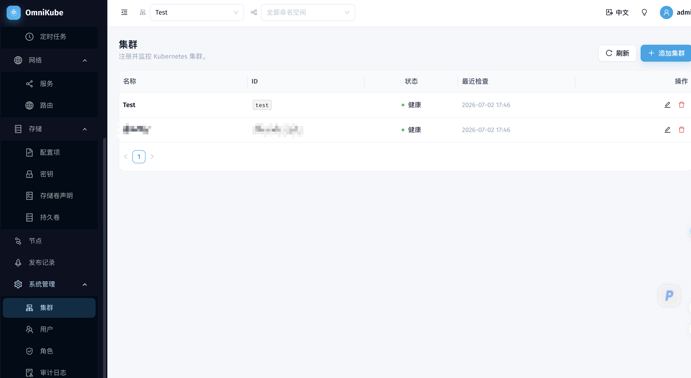 | 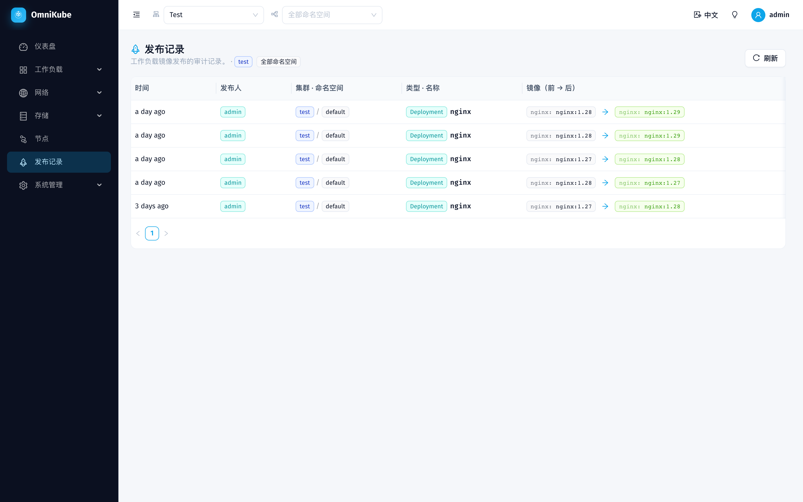 |
