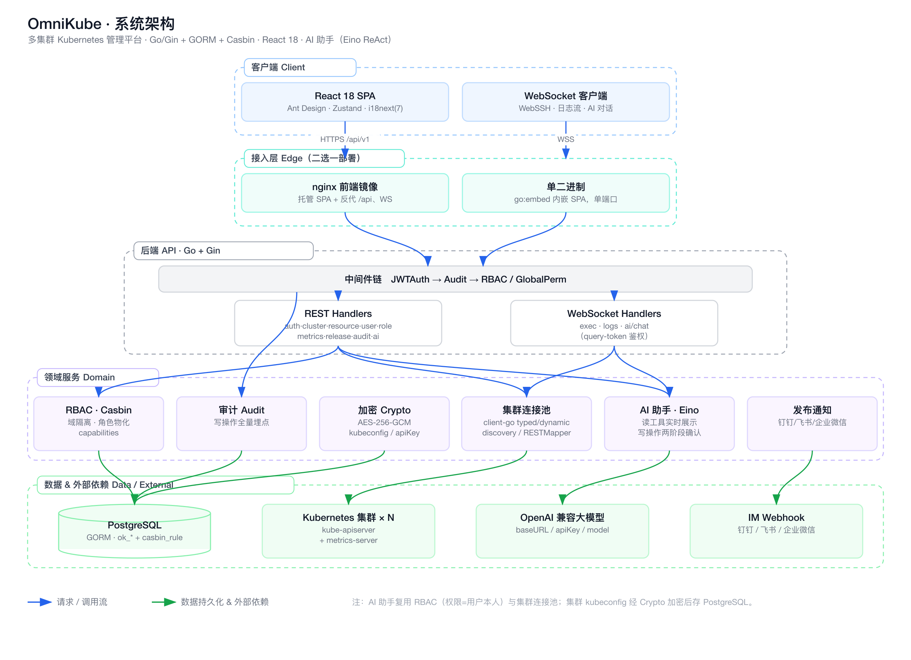
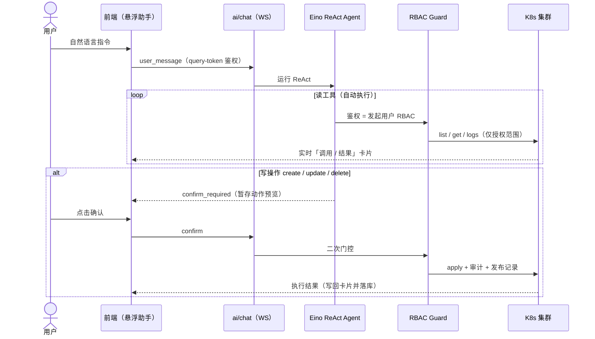
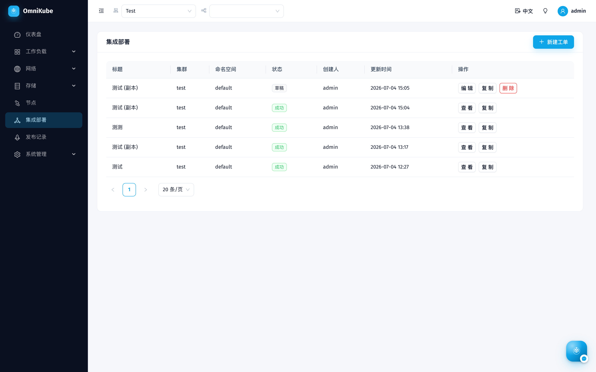
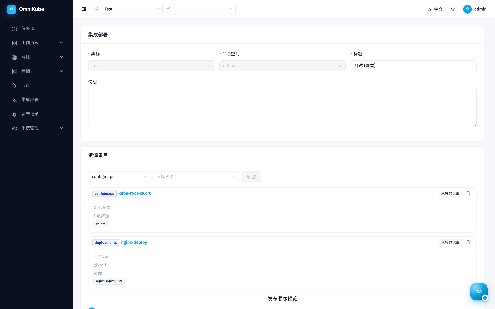
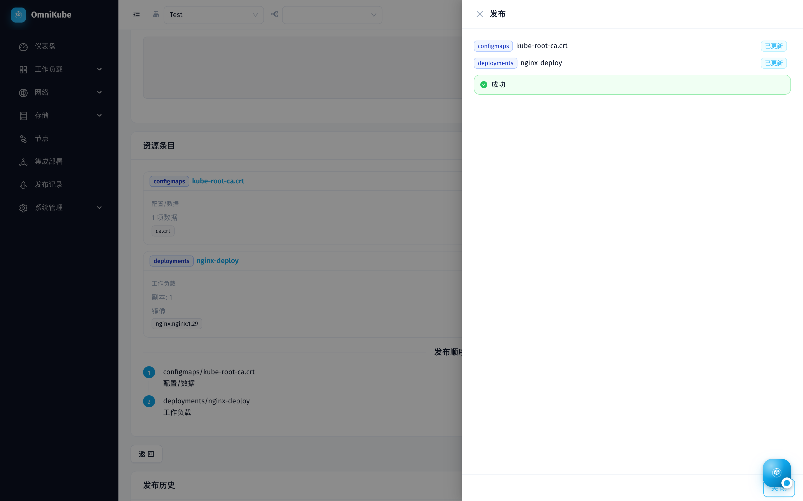
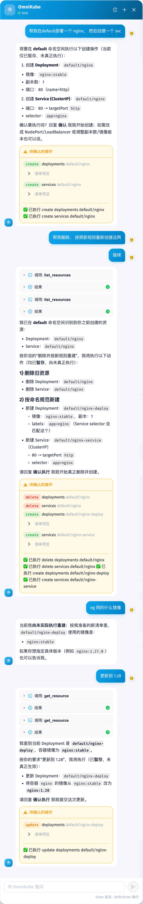

<div align="center">

# OmniKube

**统一管控每一个 Kubernetes 集群**

企业级多集群 · 多租户 Kubernetes 管理平台 —— 细粒度权限、可视化运维、实时观测、全量审计,一个控制台搞定。


</div>

---

## ✨ 功能一览

### 🤖 AI 助手（OmniKube）
- 全局**悬浮助手**,用自然语言在当前集群查询与操作资源;基于 **Eino ReAct** agent,接 **OpenAI 兼容大模型**(可配 baseURL / apiKey / modelId,系统管理 › AI 配置页,角色可授权)。
- **权限即用户本人 RBAC**:AI 只能执行发起用户本人有权限的操作,读操作按可见命名空间聚合,绝不越权(管理员则全量)。
- **对话中实时看到工具执行**:`list_resources` / `get_resource` / `get_pod_logs` 等读工具以「调用 / 执行结果」卡片**流式**展示(get 返回完整清单,能回答"用的哪个镜像")。
- **写操作两阶段确认(人在环)**:`create / update / delete` 先暂存 → 出**确认卡片** → 用户点确认后才执行,结果写回卡片并**持久化**(重载可见);创建按 `<名>-deploy`/`<名>-service` 命名规范;改镜像自动补**发布记录**(发布人 = 当前用户 + `⚡AI` 标记)。
- WebSocket 流式(`/ai/chat`,query-token 鉴权)· 多轮对话持久化 · Markdown 渲染 · 可拖动窗口 + 历史记录 · 中文输入法回车兼容。

### 多集群管理
- 多集群统一纳管:添加 / 编辑 / 删除、连接测试,kubeconfig **AES-256-GCM 加密**存储。
- 顶栏一键切换集群 / 命名空间,权限内的集群才可见。

### 工作负载与运维
- Deployment / StatefulSet / DaemonSet / Pod / Job / CronJob 列表、详情、可视化创建、YAML 编辑。
- **日常运维动作**:伸缩副本、滚动重启、**版本历史(含变更人)+ 一键回滚上一版本**、资源事件查看。
- 列表 / 详情**自动刷新**(自适应轮询),伸缩/发布后就绪数自己更新。
- **WebSSH 终端** + Pod 实时日志(WebSocket)。

### 网络 / 存储 / 节点
- Service、Ingress(带正则重写路径编辑)、ConfigMap、Secret(明文揭示带审计)、PVC、PV、Node。
- 节点 CPU / 内存**水位**、Pod 用量列、仪表盘集群资源卡(接 **metrics-server**,缺失优雅降级)。

### 系统管理:用户 / 角色 / 集群权限(RBAC v3)

**用户管理**
- 创建用户(分配一个或多个角色)、启用 / 禁用、删除。
- **首登强制改密**;管理员**重置用户密码**并生成一次性临时密码(仅管理员可见入口)。

**角色管理**
- 角色 = 可复用的权限模板;支持**新建 / 编辑 / 复制**,`roles:create` 门控。
- 预置系统角色开箱即用:**集群管理员 / 集群只读 / 开发者 / 运维工程师 / 发布管理员 / 审计员**(初始化幂等播种,不可删可编辑,角色名按语言国际化)。
- 一个用户可绑定多个角色,权限取并集。

**集群权限(细粒度授权)**
- 每个角色包含两部分:
  - **全局权限**(平台级):`clusters / users / roles / releases / audit / ai / integrated_deploy` × `view/create/edit/delete`(releases、audit 仅 view;集成部署另含 `publish` 发布动作)。
  - **集群规则**(数据面):每条规则 = **某集群(或 `*` 全部)+ 范围(整集群 / 指定命名空间)+ 「每资源 × 操作」矩阵**,操作含 `view / create / edit / delete / exec(仅 Pod)/ reveal(仅 Secret)`。
- 前端用**权限矩阵**直观勾选(而非深层树);角色规则可跨多集群配置、复用首条配置。
- 底层经 `rbac.SyncUserGrants` 把角色**物化**成 Casbin `g/p` 策略,鉴权走 domain 域隔离;删除集群时级联清理规则并重物化受影响用户。
- **菜单按权限派生**:侧边栏子菜单由用户角色里「有 view 的资源」自动生成,看不到=无权限;写操作按钮按 `capabilities` 逐项显隐。

**登录安全**:图形验证码(纯标准库生成 + 波浪扭曲防 OCR)· JWT · bcrypt · 敏感操作全量审计。

### 审计与发布
- **审计中心**:中间件统一给所有写操作(含登录、伸缩、回滚、权限变更)埋点,**显示操作者用户名**,多维下拉筛选 + 分页 + **CSV 导出**。
- **发布记录**:工作负载改镜像自动记录发布人 / 前后镜像 / 更改原因。
- **发布通知机器人**:每集群可配 **钉钉 / 飞书 / 企业微信** webhook(支持**加签密钥**),发布时自动推送格式化消息。

### 集成部署(批量协同发布)
- 把 Deployment / ConfigMap / Secret / Service 等**一组资源打包成工单**,按**固定类型优先级**(配置 → 工作负载 → 暴露)一次性、有序发布,天然解决「ConfigMap 先于 Deployment 生效」的依赖顺序。
- **从集群选取**已有资源(快照当前 YAML),复用平台**可视化 + YAML 编辑器**暂存编辑、发布时才下发;添加工作负载时**自动识别并拉入其挂载的 ConfigMap / Secret**,一并协同发布。
- 点「发布」开**侧边栏 WebSocket 实时流**,逐资源展示 已创建 / 已更新 / 失败 / 跳过,**遇错即停**。
- 工单可**复制**;已发布工单只读(仅查看 + 复制);每次发布只写**一条**发布记录。
- 独立权限区域 `integrated_deploy`(`view / create / edit / delete / **publish**`),且每条资源**二次经用户自身的资源级 RBAC** 校验,可选资源按写权限过滤。

### 体验
- **国际化**:中 / 英 / 日 / 韩 / 法 / 德 / 西 共 **7 种语言**。
- **明 / 暗主题**切换;登录页、密码页统一精致视觉。

---

## 🧱 技术栈

| 层 | 技术 |
|----|------|
| 后端 | Go · Gin · GORM · Casbin · client-go(dynamic client)· Google Wire(DI)· PostgreSQL |
| 前端 | React 18 · TypeScript · Vite · Ant Design 5 · Zustand · react-i18next · react-markdown |
| AI | Eino ReAct agent · OpenAI 兼容大模型(baseURL / apiKey / modelId) |
| 观测 | metrics-server(节点 / Pod 用量) |
| 实时 | WebSocket(WebSSH 终端 · 日志流 · AI 对话 · 集成部署发布进度流) |
| 交付 | 单二进制内嵌 SPA(`go:embed`)或 nginx + API 双镜像 · GitHub Actions → Docker Hub |

---

## 🏛️ 架构

分层架构:浏览器内的 React SPA 经**接入层**(单二进制内嵌 SPA,或 nginx 前端镜像反代)到达 **Gin API**;API 经统一的中间件链(**JWT → 审计 → RBAC**)分发到 REST 与 WebSocket 处理器;下沉到领域服务(**Casbin 鉴权**、**client-go 集群连接池**、**Eino AI 助手**、发布通知、加密、审计),最终对接 PostgreSQL、多个 Kubernetes 集群、metrics-server、大模型与 IM Webhook。



**请求与鉴权**:公开路由仅 `login` / `captcha` / `healthz`;其余走 `authed` 组 —— `JWTAuth`(解析 `Authorization: Bearer`)→ `Audit`(写操作按最终状态码埋点)。之上三档授权:平台级端点用 `RequireGlobalPerm`,集群级动态资源用 `RBACAuthMiddleware`(读 `X-Cluster-ID` 头 → 连接池取客户端 → RESTMapper 归一资源 → Casbin 按 `域=集群[:命名空间]` 鉴权);管理员旁路。WebSocket 因浏览器无法设头,改用 query 的 `token` 在升级前鉴权。

**AI 助手交互流**(ReAct + 人在环):



---

## 🚀 快速开始

### 前置
- Go 1.22+、Node 18+、一个可访问的 Kubernetes 集群(kubeconfig)
- PostgreSQL(下方用 Docker 起一个)

### 1. 数据库
```bash
docker run -d --name omnikube-pg -p 5433:5432 \
  -e POSTGRES_USER=omnikube -e POSTGRES_PASSWORD=omnikube -e POSTGRES_DB=omnikube \
  postgres:16
```

### 2. 后端
```bash
cd backend
cp config.yaml.example config.yaml   # 填 jwt_secret(≥32 字符)、master_key(base64 32 字节)
#   openssl rand -hex 32   /   openssl rand -base64 32
go run ./cmd/server -config config.yaml   # 监听 :8080,首启自动建表 + 播种 admin 与预置角色
```

### 3. 前端
```bash
cd frontend
npm install
npm run dev            # :5173,已配代理 /api + ws → :8080
```

打开 http://localhost:5173,用 config 里的 admin 账号登录(首登会要求改密)。

> **首次启动自举**:后端启动即自动**建库建表**、**幂等播种预置角色**,并在 `ok_users` 为空时创建管理员——**用户名与一次性初始密码会打印到启动日志**(仅一次),该账号**首登强制改密**。

---

## 🐳 Docker 部署

拆成两个镜像(同一仓库,tag 前缀区分):

| 组件 | 镜像 |
|------|------|
| 后端 API(REST + WebSocket) | `twwch/omnikube:api-<版本>` |
| 前端(nginx 托管 SPA + 反代 `/api`) | `twwch/omnikube:frontend-<版本>` |

`<版本>` 为 `latest`(main)或标签名(如 `v1.0.0`)。

### 一键起(compose:Postgres + API + 前端)

```bash
JWT_SECRET=$(openssl rand -hex 32) MASTER_KEY=$(openssl rand -base64 32) \
  docker compose up -d          # 加 --build 可本地构建

docker compose logs api         # 查看初始 admin 用户名 + 一次性密码
```

打开 http://localhost:8080 登录(首登强制改密)。前端容器把 `/api`(含 exec/日志 WebSocket)反代到 `api:8080`。

**CI/CD**(`.github/workflows/release.yml`):`main` 推送 → 跑测试 → 构建并推送 `api-latest` / `frontend-latest`(+ `-<sha>`);打 `vX.Y.Z` 标签 → 推送 `api-vX.Y.Z` / `frontend-vX.Y.Z` 并**自动生成 GitHub Release**(正文取自 **tag 注解消息** + 自动汇总的提交摘要)。

> 需在仓库 Secrets 配置 `DOCKERHUB_USERNAME`、`DOCKERHUB_TOKEN`。

---

## 📁 目录结构

```
backend/    Go 后端(cmd/server 入口;app=Wire DI;internal: handler / rbac / cluster /
            ai(Eino) / ws / notify / captcha / audit / middleware / crypto / web(内嵌 SPA) ...)
backend/migrations/   版本化 SQL 迁移文件(NNN_desc.sql,与 GORM AutoMigrate 对应,见 CLAUDE.md)
frontend/   React 前端(src: pages / components(含 AiAssistant) / api / store / i18n)
docs/       设计文档(docs/superpowers/specs)、功能查漏 feature-gaps.md
images/     界面截图
video/      产品演示视频(成片 + 可复现源码)
CLAUDE.md   项目约定(重点:数据库变更规范 —— 改模型 + AutoMigrate + 加编号迁移文件)
```

---

## 🧪 测试

```bash
# 后端
cd backend && go test ./...

# 前端
cd frontend && npm run lint && npm test && npm run build
```

---

## 📸 界面截图

### 工作负载

| 部署列表 | 部署详情 | 容器组 |
|---|---|---|
|  |  |  |

| 有状态副本集 | 守护进程集 | 定时任务 |
|---|---|---|
|  |  |  |

### 网络 · 存储 · 节点

| 服务 | ConfigMap | 节点 |
|---|---|---|
|  |  |  |

### 系统管理

| 用户 | 角色 | 审计日志 |
|---|---|---|
|  |  |  |

| 集群管理 | 发布记录 |
|---|---|
|  |  |

### 集成部署

把一组资源打包成工单,按「配置 → 工作负载 → 暴露」固定顺序一次性、有序发布;点发布侧边栏 **WebSocket 实时**逐资源展示结果(已创建 / 已更新 / 失败 / 跳过)。已发布工单只读(仅查看 + 复制)。

| 工单列表 | 工单编辑(资源卡片) | 实时发布 |
|---|---|---|
|  |  |  |

### AI 助手

用自然语言创建 / 更新 / 删除资源:ReAct 实时展示工具调用,写操作**两阶段确认**后才执行。下图完整演示「在 default 部署 nginx + 建 Service → 按命名规范(`nginx-deploy` / `nginx-service`)重建 → 升级镜像到 1.28」,每步确认卡片内直接输出执行结果。

<p align="center"></p>

> 系统架构图见上方 [🏛️ 架构](#-架构) 一节(`images/00-architecture.png`)。
